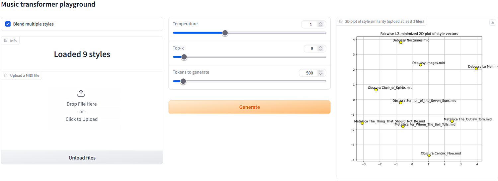

## Music transformer with indefinitely preserved style

### Output demo: https://www.youtube.com/watch?v=Ic3mHu0uUwg

The model is essentially a transformer with relative attention but but it uses a style token produced by an encoder, which is pre-appended to the sequence and remains unchanged throughout decoding.
During training, the encoder's input is a random subsequence of the target sequence, and when generating it's the sequence from which we want to copy the style. 
In practice it preserves the feel of the original sequence even when the attention window is exceeded several times.
Another difference from similar architectures is that the vocabulary contains no note_off tokens. When parsing midi, they are ignored. Given that most of the events are note-related, this approach helps the model focus more on the melody than on composition.
Pretrained model uses 8 layers in decoder, 256 embedding dimentions, and a window of 1024 tokens.

Trained on Maestro and a new dataset of 23k metal midi files I assembled: https://www.kaggle.com/datasets/mmaximssew/metal-midi-dataset

### Try it
- Download a pretrained model: https://drive.google.com/drive/folders/1Lz6VbTK7Tqk8He0MMZmrbypoPNOS_wYo (metal was finetuned on my personal favorites)
- Create a 'checkpoint' folder in project directory, place one of the pretrained models inside it. 
The Gradio inference UI allows you to upload midi files, select style subsequence and generate melodies. You can also load multiple styles, in which case it will average the styles for generation. From my experiments, doing so yields expected results, combining different aspects of melodies in unpredictable ways, fun to play with.
It also makes a 2d plot of style vectors that minimizes pairwise L2 distance divergence. Naive, but why not.
